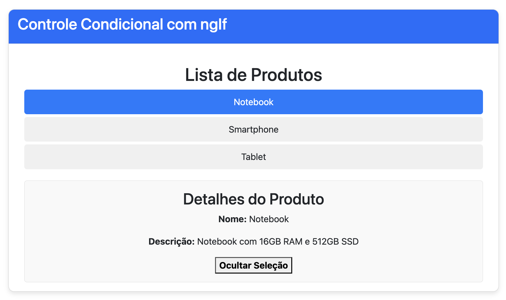
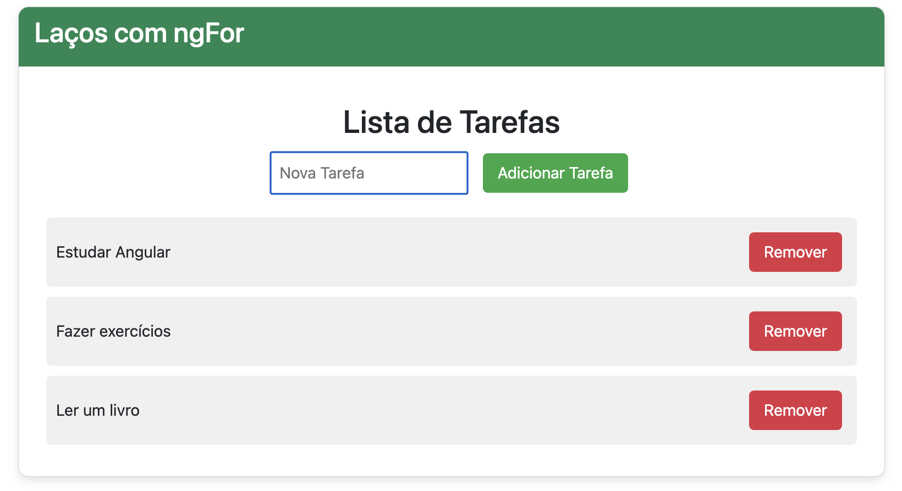
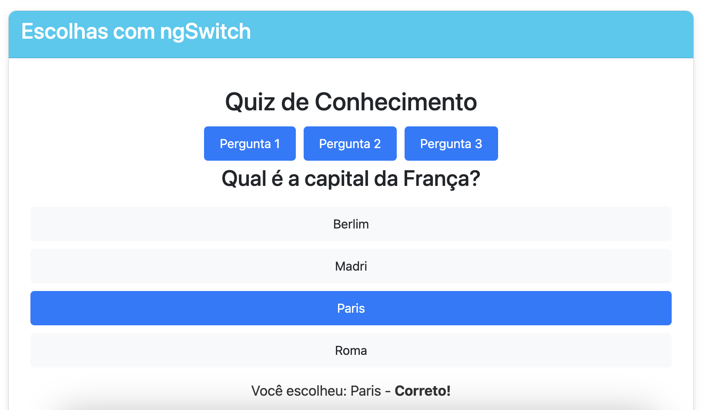

# Control Flow em Angular

O **Control Flow** (fluxo de controle) em Angular refere-se ao uso de diretivas estruturais para manipular a exibição de elementos com base em condições, loops e escolhas. As principais diretivas que controlam o fluxo de uma aplicação Angular são `*ngIf`, `*ngFor` e `*ngSwitch`.

## Diretivas Estruturais

### 1. **`*ngIf`**: Condicionais
A diretiva `*ngIf` é usada para condicionalmente adicionar ou remover um elemento do DOM com base em uma expressão booleana.

#### Exemplo:
```html
<div *ngIf="isVisible">Este conteúdo é visível se isVisible for verdadeiro!</div>
```

Neste exemplo, o elemento `<div>` só será renderizado se a variável **`isVisible`** for `true`.

### 2. **`*ngFor`**: Laços
A diretiva `*ngFor` permite iterar sobre uma coleção de dados e renderizar um template para cada item da lista.

#### Exemplo:
```html
<ul>
  <li *ngFor="let item of items">{{ item }}</li>
</ul>
```

Aqui, o elemento `<li>` será repetido para cada item da coleção **`items`**.

### 3. **`*ngSwitch`**: Estrutura de Escolha
A diretiva `*ngSwitch` permite alternar entre várias visualizações com base no valor de uma expressão.

#### Exemplo:
```html
<div [ngSwitch]="cor">
  <div *ngSwitchCase="'vermelho'">A cor é vermelho</div>
  <div *ngSwitchCase="'azul'">A cor é azul</div>
  <div *ngSwitchDefault>Cor desconhecida</div>
</div>
```

Neste exemplo, o Angular exibe uma das opções com base no valor da variável **`cor`**.

#### Conclusão
As diretivas estruturais `*ngIf`, `*ngFor` e `*ngSwitch` são essenciais para controlar o fluxo de uma aplicação Angular. Elas permitem adicionar lógica condicional, iterações e escolhas dinâmicas, tornando o código mais interativo e eficiente.

### Exemplo de uso do control flow




