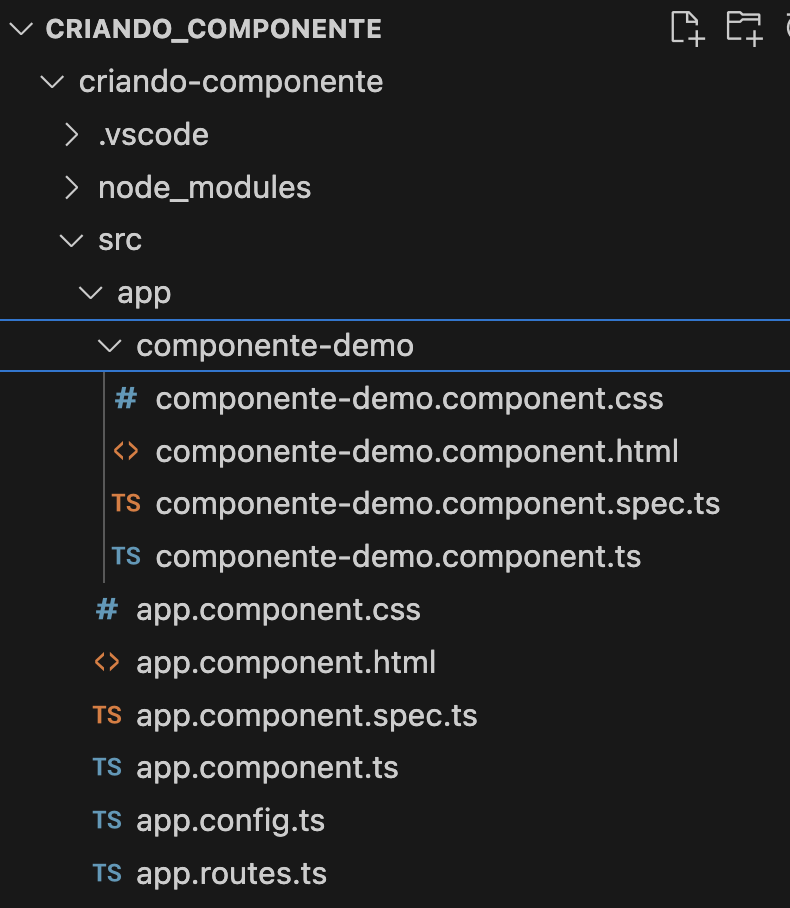
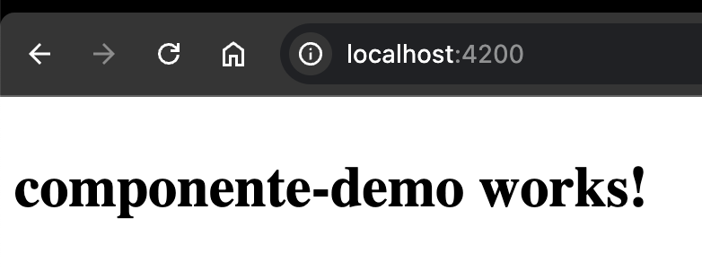

### Criando Componente

Componentes em Angular são como **"blocos de construção"** de uma aplicação. Cada componente é responsável por uma parte específica da interface do usuário (UI). 
Por exemplo, em uma página de tarefas, você pode ter um componente para a lista de tarefas, outro para o formulário de adicionar tarefa, e assim por diante.

#### Cada componente é feito de três partes principais:

1. **Template (HTML):** Define como a interface visual do componente será exibida.
2. **Classe (TypeScript):** Contém a lógica do componente, ou seja, como ele funciona e como os dados são manipulados.
3. **Estilos (CSS):** Define a aparência visual (cores, tamanhos, etc.) do componente.

Esses componentes são independentes, o que significa que você pode reaproveitar e organizar facilmente diferentes partes da aplicação.


#### Vamos criar um componente com o nome componente-demo

``ng g c nome-do-componente``


1. Abrir o terminal na pasta do projeto Angular
Executar o comando:
```
ng g c componente-demo
```



#### Exibindo o componente no navegador

1. Abra o arquivo: `app.component.html`
- Apague o conteúdo da página
- Coloque o nome do componente desejado:
```

<h1> <app-componente-demo></app-componente-demo></h1>
 ```
- Confirme se o componente foi exportado para o arquivo app.component.ts

```
import { Component } from '@angular/core';
import { RouterOutlet } from '@angular/router';
import { ComponenteDemoComponent } from "./componente-demo/componente-demo.component";

@Component({
  selector: 'app-root',
  standalone: true,
  imports: [RouterOutlet, ComponenteDemoComponent],
  templateUrl: './app.component.html',
  styleUrl: './app.component.css'
})
export class AppComponent {
  title = 'criando-componente';
}
```

2. Execute o servidor: `ng s`




