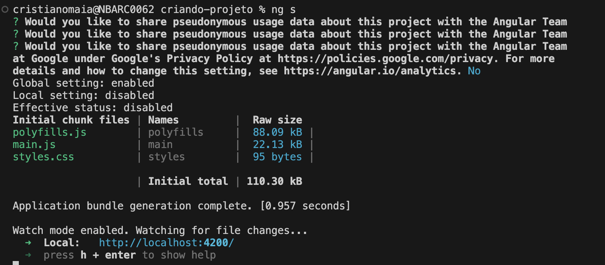
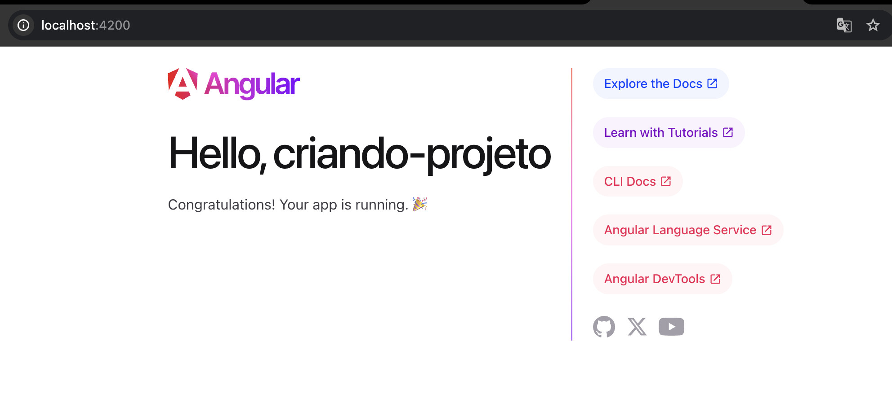

### Criar e executar projetos no Angular 17
Treinamento de Angular 17, criando nosso projeto, veja abaixo como realizar o procedimento:

1.  Abra o Prompt de Comando (Windows) ou Terminal (MacOS ou Linux).

2.  Utilize o comando: npm install -g @angular/cli@17, assim será gerado um projeto utilizando a versão 17, caso queira utilizar a versão mais atual do framework, utilize o comando: npm install -g @angular/cli.

3. Agora podemos criar um projeto, selecione um diretório e utilize o seguinte comando: ``ng new criando-projeto``. O comando ng new serve para criarmos um novo projeto.

**Agora precisamos realizar algumas configurações:**

- Estilo do projeto: CSS
- Server-side rendering: Não

4. Abra o Visual Studio Code, selecione o projeto

5. No VSCode abra o terminal e digite o comando: ng s, fazendo com que o projeto seja executado e disponbilizado no endereço: ``localhost:4200``

Pronto! Agora aprendemos a criar e executar projetos Angular, abaixo algumas dicas importantes.

Sobre o server-side rendering, ele está disponível na criação de projetos a partir da versão 17 do Angular, algumas vantagens ao utilizar:

- Garante uma melhor performance
- Melhora o uso de SEO
- Importante saber que utilizando o server-side rendering, o servidor terá mais uma funcionalidade para realizar, já que ele será responsável por renderizar os projetos em Angular. 
- Vale a pena utilizar essa técnica, caso o navegador tenha dificuldades para renderizar a aplicação.

**Vimos que para executar um projeto utilizamos o comando ng s, mas temos outras opções:**

`ng serve`: maneira padrão para executar um projeto Angular
`ng s`: faz o mesmo que o ng serve, porém encurtamos o termo serve para s
`ng server --open`: assim que terminar de renderizar a aplicação, automaticamente o navegador é aberto
`ng s -o`: faz o mesmo que o `ng server --open`, porém encurtamos os termos server e --open

**A estrutura de um projeto Angular é composta por:**

- **.angular:** Local com todas as informações do framework para realizar a execução de maneira correta
- **.vscode:** Possui as configurações base do Visual Studio Code (talvez esteja oculta, não há problema, pois não iremos modificar)
- **node_modules:** Estrutura de dependências do Node e do Vue
- **src:** Estrutura de componentes da aplicação
- **.gitignore:** Arquivos que não serão enviados para repositórios
- **angular.json:** Arquivo contendo todas as dependências que o Angular utiliza
- **package-lock.json:** Estrutura detalhada de pacotes do Node
- **package.json:** Estrutura de pacotes utilizadas pelo Vue, além de informações básicas do projeto, como: nome do projeto e versão
- **README.md:** Arquivo contendo as instruções de uso e estrutura do projeto
- **tsconfig.json:** Configurações da linguagem TypeScript

