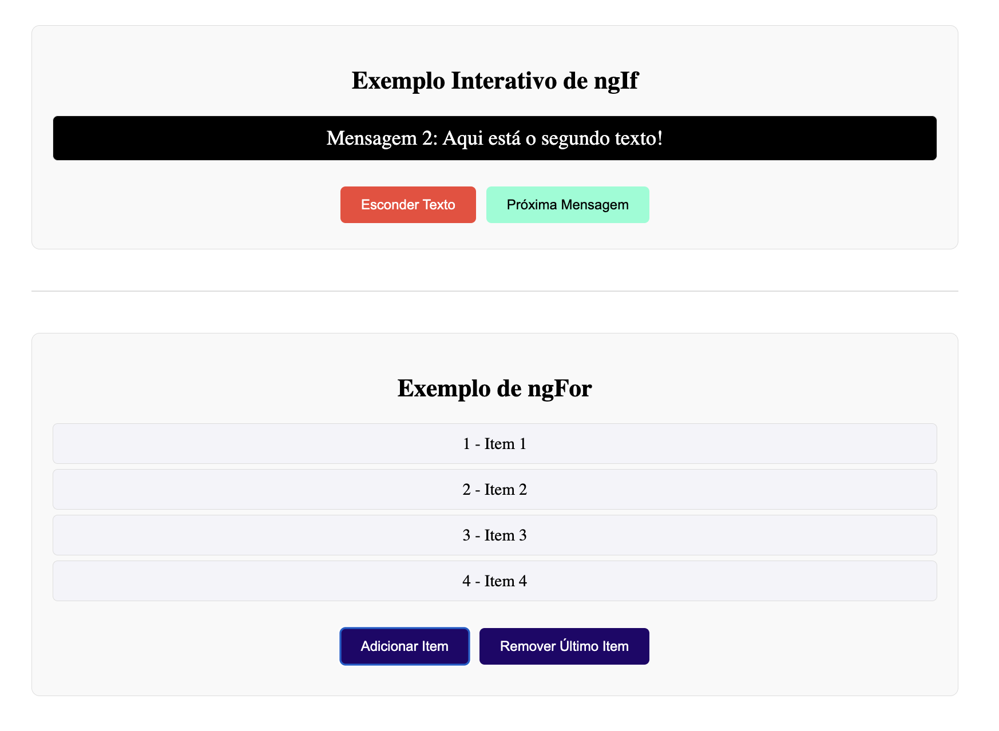
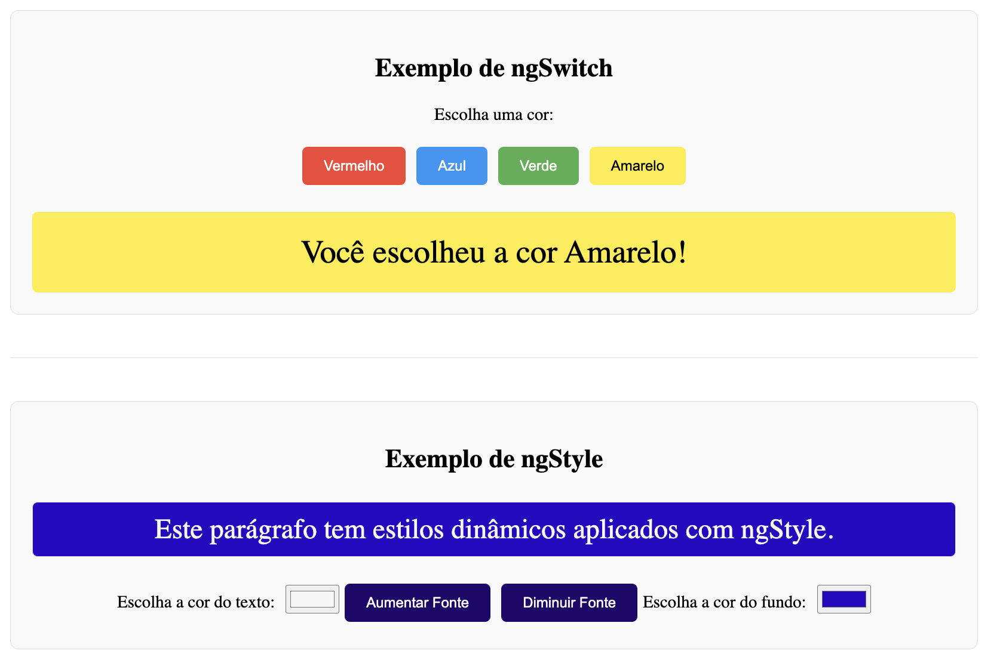
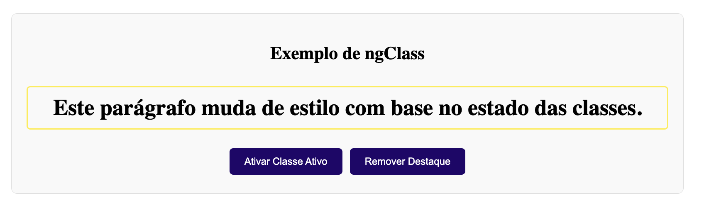

# Diretivas em Angular

As **diretivas** em Angular são uma das funcionalidades mais poderosas do framework, permitindo manipular a estrutura do DOM e o comportamento dos elementos na interface. Diretivas podem ser classificadas em três tipos principais:

1. **Diretivas estruturais**: Alteram a estrutura do DOM, adicionando ou removendo elementos.
2. **Diretivas de atributo**: Alteram o comportamento ou a aparência de um elemento existente.
3. **Diretivas customizadas**: Criadas pelo desenvolvedor para manipular o comportamento de elementos de forma personalizada.

## Tipos de Diretivas

### 1. Diretivas Estruturais
As diretivas estruturais alteram a estrutura do DOM com base em condições lógicas ou iterações. São identificadas pelo prefixo `*`.

#### **ngIf**
A diretiva `*ngIf` adiciona ou remove elementos do DOM com base em uma expressão booleana.

```html
<div *ngIf="mostrarElemento">Este elemento só aparece se mostrarElemento for verdadeiro.</div>
```

#### **ngFor**
A diretiva `*ngFor` permite iterar sobre uma coleção e renderizar um elemento para cada item.

```html
<ul>
  <li *ngFor="let item of lista">{{ item }}</li>
</ul>
```

#### **ngSwitch**
A diretiva `*ngSwitch` permite alternar entre várias visualizações com base no valor de uma expressão.

```html
<div [ngSwitch]="valor">
  <div *ngSwitchCase="'valor1'">Caso 1</div>
  <div *ngSwitchCase="'valor2'">Caso 2</div>
  <div *ngSwitchDefault>Caso padrão</div>
</div>
```

### 2. Diretivas de Atributo
As diretivas de atributo modificam o comportamento ou o estilo de um elemento existente no DOM.

#### **ngClass**
A diretiva `ngClass` permite aplicar classes CSS condicionalmente a um elemento.

```html
<div [ngClass]="{ 'ativo': isActive, 'inativo': !isActive }">Classe condicional</div>
```

#### **ngStyle**
A diretiva `ngStyle` permite aplicar estilos CSS dinamicamente a um elemento.

```html
<div [ngStyle]="{ 'background-color': corFundo }">Estilo dinâmico</div>
```

### 3. Diretivas Customizadas
Além das diretivas embutidas, você pode criar suas próprias diretivas customizadas para manipular comportamentos específicos nos elementos.

#### Exemplo de Diretiva Customizada
Aqui está um exemplo básico de uma diretiva que altera a cor de fundo de um elemento ao passar o mouse.

```typescript
import { Directive, ElementRef, Renderer2, HostListener } from '@angular/core';

@Directive({
  selector: '[appHighlight]'
})
export class HighlightDirective {
  constructor(private el: ElementRef, private renderer: Renderer2) {}

  @HostListener('mouseenter') onMouseEnter() {
    this.renderer.setStyle(this.el.nativeElement, 'background-color', 'yellow');
  }

  @HostListener('mouseleave') onMouseLeave() {
    this.renderer.removeStyle(this.el.nativeElement, 'background-color');
  }
}
```

Para usar a diretiva, basta aplicá-la no HTML:

```html
<p appHighlight>Passe o mouse aqui para ver o destaque!</p>
```

#### Conclusão
As diretivas em Angular são essenciais para criar uma interface dinâmica e interativa, permitindo que os desenvolvedores manipulem o DOM de forma poderosa e eficiente. Com elas, é possível criar comportamentos complexos e personalizar a experiência do usuário diretamente no HTML.

Este projeto incluirá exemplos práticos de cada tipo de diretiva, mostrando como elas podem ser aplicadas em diferentes cenários.


### Exemplos de Diretivas






