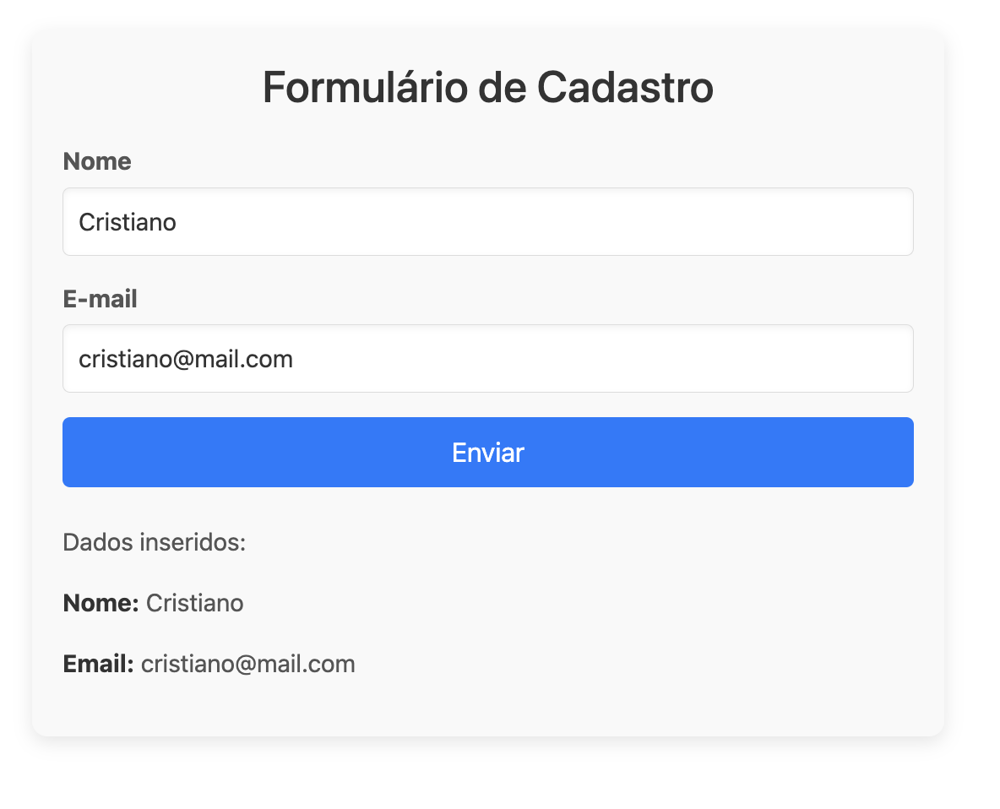

# FormsModule em Angular

O **FormsModule** é um módulo do Angular utilizado para trabalhar com **formulários template-driven** (baseados em templates). Ele facilita o gerenciamento de formulários, permitindo uma ligação bidirecional entre os campos do formulário e o modelo de dados no componente.

## Características do FormsModule
- Permite o **two-way data binding** através da diretiva **ngModel**.
- Suporta validação de formulários e exibição de mensagens de erro.
- Facilita a captura de eventos e a interação com formulários HTML de maneira declarativa.

## Como usar o FormsModule

1. **Importar o FormsModule** no seu módulo:
   
   No arquivo do módulo (por exemplo, `app.module.ts`), é necessário importar o `FormsModule`:

   ```typescript
   import { FormsModule } from '@angular/forms';

   @NgModule({
     declarations: [AppComponent],
     imports: [FormsModule],
     bootstrap: [AppComponent]
   })
   export class AppModule {}
   ```

2. **Usando ngModel para Two-Way Data Binding**:

   Uma das principais funcionalidades do FormsModule é o **two-way data binding**, que permite sincronizar os valores do campo do formulário com as propriedades do componente.

   Exemplo:
   ```html
   <input [(ngModel)]="nome" placeholder="Digite seu nome" />
   <p>Olá, {{ nome }}!</p>
   ```

   Neste exemplo:
   - O `[(ngModel)]` cria uma ligação bidirecional entre a variável `nome` no componente e o campo de input.
   - Quando o valor do campo de input muda, a variável `nome` é atualizada automaticamente, e vice-versa.

## Validação com FormsModule

O FormsModule também permite adicionar validações de maneira declarativa no template.

Exemplo:
```html
<form>
  <input [(ngModel)]="email" name="email" required email placeholder="Digite seu e-mail" />
  <div *ngIf="!emailForm.valid && emailForm.dirty">
    <p>E-mail inválido.</p>
  </div>
</form>
```

- A diretiva `required` indica que o campo é obrigatório.
- A diretiva `email` verifica se o valor é um e-mail válido.
- A mensagem de erro só é exibida se o campo for inválido e modificado.

## Conclusão
O **FormsModule** facilita o uso de formulários no Angular ao fornecer uma maneira simples de vincular dados, gerenciar eventos e adicionar validação a campos de entrada. É especialmente útil para formulários pequenos e médios, onde o foco está na simplicidade.

## Exemplo FormsModule


