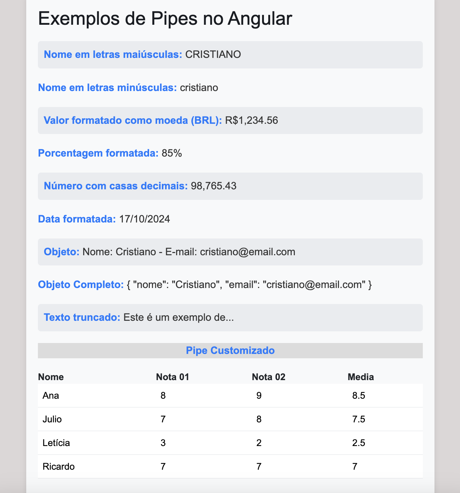

## Pipes em Angular

## O que são Pipes?

No Angular, **pipes** são usados para transformar dados em exibições dentro de templates de forma declarativa. Eles permitem que você formate valores diretamente no HTML, sem a necessidade de escrever lógica extra no componente. Um exemplo comum de uso de pipes é a formatação de datas, moedas ou a conversão de strings para maiúsculas/minúsculas.

## Como utilizar Pipes

Os pipes podem ser utilizados diretamente no template de um componente com a sintaxe de pipe (|). O valor do lado esquerdo do operador pipe é transformado pelo pipe que está à direita.

### Exemplo de uso de Pipe

```html
<!-- Template HTML -->
<p>{{ nome | uppercase }}</p> <!-- Converte o nome para letras maiúsculas -->

<p>{{ valor | currency:'BRL' }}</p> <!-- Formata o valor como moeda brasileira -->
```

## Pipes Comuns

Angular oferece diversos pipes embutidos que podem ser utilizados para diferentes tipos de transformações:

- **DatePipe**: Formata datas.
- **UpperCasePipe**: Converte uma string para letras maiúsculas.
- **LowerCasePipe**: Converte uma string para letras minúsculas.
- **CurrencyPipe**: Formata valores numéricos como uma moeda.
- **DecimalPipe**: Formata números com casas decimais.
- **PercentPipe**: Formata valores numéricos como percentagem.
  
### Exemplo de uso de DatePipe

```html
<p>{{ hoje | date:'dd/MM/yyyy' }}</p>
```

No exemplo acima, a variável `hoje` será exibida no formato de data `dd/MM/yyyy`.

## Pipes Personalizados

Além dos pipes fornecidos pelo Angular, você pode criar seus próprios pipes personalizados. Para isso, é necessário criar uma classe com o decorator `@Pipe` e implementar o método `transform`.

### Exemplo de Pipe Personalizado

Crie um pipe que converte uma string para uma versão truncada com um número máximo de caracteres:

```typescript
import { Pipe, PipeTransform } from '@angular/core';

@Pipe({
  name: 'truncate'
})
export class TruncatePipe implements PipeTransform {
  transform(value: string, limit: number): string {
    return value.length > limit ? value.substring(0, limit) + '...' : value;
  }
}
```

Agora, você pode usar o pipe personalizado no template:

```html
<p>{{ texto | truncate:10 }}</p> <!-- Exibe apenas os primeiros 10 caracteres -->
```

## Encadeamento de Pipes

É possível usar mais de um pipe em um mesmo valor, encadeando-os. A ordem de execução segue a sequência da esquerda para a direita.

### Exemplo de Encadeamento de Pipes

```html
<p>{{ valor | currency:'BRL' | uppercase }}</p> <!-- Converte o valor em moeda e depois em letras maiúsculas -->
```

## Conclusão

Os pipes são uma ferramenta poderosa para transformar dados de forma simples e eficiente nos templates do Angular. Além dos pipes nativos, o Angular permite a criação de pipes personalizados, possibilitando maior flexibilidade no processamento de dados para exibição.


### Exemplo Pipes

