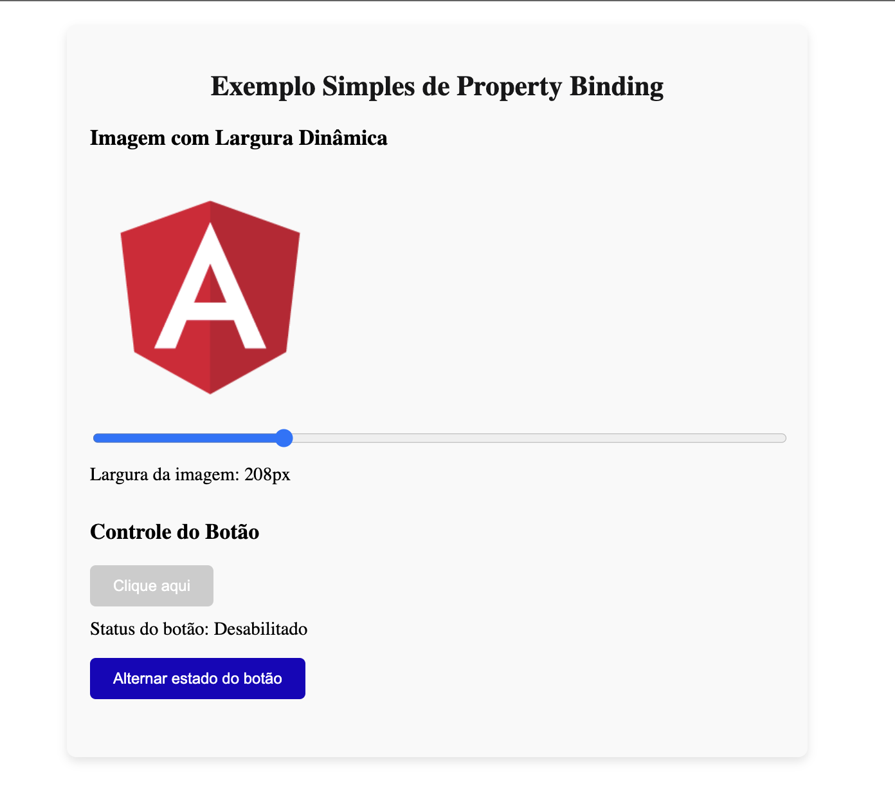

### Property Binding em Angular

**Property Binding** em Angular é a maneira de "vincular" o valor de uma propriedade (ou atributo) de um elemento HTML a uma variável ou propriedade do componente TypeScript. Com isso, você consegue alterar dinamicamente o comportamento ou a aparência de um elemento na interface.

##### Como funciona:

A sintaxe básica de **property binding** envolve usar colchetes `[]` ao redor da propriedade que você quer modificar:

```html
<elemento [propriedade]="valor"></elemento>
```

- **`[propriedade]`**: É a propriedade do elemento HTML que você quer modificar.
- **`valor`**: É o valor da propriedade, que pode vir diretamente do TypeScript.

## Exemplo simples:

Vamos supor que você tenha uma variável `imagemUrl` no seu componente TypeScript e queira alterar a imagem exibida dinamicamente:

#### **TypeScript** (`app.component.ts`):
```typescript
export class AppComponent {
  imagemUrl = 'https://angular.io/assets/images/logos/angular/angular.png';
}
```

#### **HTML** (`app.component.html`):
```html

```

Neste exemplo, o atributo `src` da tag `` vai receber o valor de `imagemUrl` do TypeScript. Se o valor de `imagemUrl` mudar, a imagem também vai mudar automaticamente.

#### Propriedades com **Property Binding**:

Você pode usar **property binding** para controlar várias propriedades de elementos, como:
- **`src`**: Para definir a URL de uma imagem.
- **`disabled`**: Para habilitar ou desabilitar botões.
- **`hidden`**: Para mostrar ou esconder elementos.
- **`value`**: Para definir o valor de um campo de input.

## Exemplo prático com um botão:

#### **TypeScript**:
```typescript
export class AppComponent {
  botaoDesabilitado = true;
}
```

#### **HTML**:
```html
<button [disabled]="botaoDesabilitado">Botão</button>
```

Aqui, o botão será desabilitado porque a variável **`botaoDesabilitado`** é `true`. Se você mudar o valor para `false`, o botão ficará habilitado.

### Resumo:
- **Property binding** permite vincular valores das propriedades HTML com variáveis do TypeScript.
- A sintaxe usa colchetes `[]` para dizer ao Angular que o valor virá do TypeScript.
- Quando a variável no TypeScript muda, o elemento HTML reflete essa mudança automaticamente.

Esse tipo de binding é muito útil quando você quer alterar dinamicamente elementos na interface.


#### Exemplo Property Binding


