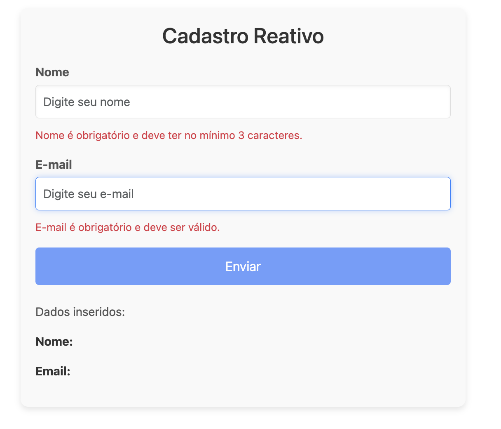

# Reactive Forms em Angular

O **Reactive Forms** é uma abordagem usada no Angular para trabalhar com formulários de maneira reativa e programática. Ele oferece maior controle sobre o estado, a validação e as interações dos campos do formulário. Ao contrário do **FormsModule**, que é baseado em templates, o Reactive Forms trabalha com **modelos baseados em objetos** no TypeScript, tornando-o mais adequado para formulários complexos e interações dinâmicas.

## Principais Características:
1. **Modelo baseado em objetos**: O formulário é representado por uma estrutura de dados no TypeScript (FormGroup, FormControl).
2. **Validação reativa**: Você pode adicionar validações síncronas e assíncronas diretamente no modelo de dados.
3. **Controle total sobre o estado do formulário**: Os campos e o status do formulário podem ser controlados e observados com maior flexibilidade.

## Como usar o Reactive Forms

1. **Importar o ReactiveFormsModule**:
   
   Para começar a usar os formulários reativos, é necessário importar o `ReactiveFormsModule` no componente standalone ou no módulo onde o formulário será utilizado.

   ```typescript
   import { ReactiveFormsModule } from '@angular/forms';
   ```

2. **Criar o FormGroup e FormControl**:

   No Reactive Forms, você cria o modelo do formulário programaticamente usando **`FormGroup`** (um grupo de controles) e **`FormControl`** (um controle individual).

   Exemplo de criação de um formulário simples:
   ```typescript
   import { Component } from '@angular/core';
   import { FormGroup, FormControl } from '@angular/forms';

   @Component({
     selector: 'app-exemplo-form',
     templateUrl: './exemplo-form.component.html',
     standalone: true,
     imports: [ReactiveFormsModule]
   })
   export class ExemploFormComponent {
     formulario = new FormGroup({
       nome: new FormControl(''),  // Controla o campo "nome"
       email: new FormControl('')  // Controla o campo "email"
     });

     // Método para manipular o envio do formulário
     onSubmit() {
       console.log(this.formulario.value);
     }
   }
   ```

3. **Ligação com o template HTML**:

   No template, você usa diretivas como **`formGroup`** e **`formControlName`** para vincular os campos do formulário ao modelo no TypeScript.

   Exemplo de template:
   ```html
   <form [formGroup]="formulario" (ngSubmit)="onSubmit()">
     <label for="nome">Nome</label>
     <input id="nome" type="text" formControlName="nome" />

     <label for="email">Email</label>
     <input id="email" type="email" formControlName="email" />

     <button type="submit">Enviar</button>
   </form>
   ```

4. **Validação com Reactive Forms**:

   A validação é aplicada diretamente no **FormControl** ao criar o modelo do formulário. Você pode adicionar validações padrão (como `required`, `minLength`, etc.) ou criar validações personalizadas.

   Exemplo com validação:
   ```typescript
   import { Validators } from '@angular/forms';

   formulario = new FormGroup({
     nome: new FormControl('', [Validators.required, Validators.minLength(3)]),
     email: new FormControl('', [Validators.required, Validators.email])
   });
   ```

   Exibir mensagens de erro no template:
   ```html
   <div *ngIf="formulario.get('nome').invalid && formulario.get('nome').touched">
     O nome é obrigatório e deve ter pelo menos 3 caracteres.
   </div>
   ```

## Diferenças entre Reactive Forms e FormsModule:

1. **Abordagem**:
   - **Reactive Forms**: Baseado em código TypeScript. Maior controle sobre a lógica e estado dos campos.
   - **FormsModule**: Baseado em templates. Menos flexível, mas mais fácil de implementar para formulários simples.

2. **Validação**:
   - **Reactive Forms**: A validação é controlada de forma programática no TypeScript.
   - **FormsModule**: A validação é feita diretamente no template.

3. **Escalabilidade**:
   - **Reactive Forms** são mais indicados para formulários complexos e grandes aplicações que exigem lógica avançada de manipulação de dados.

## Conclusão:
O **Reactive Forms** oferece mais controle e flexibilidade para criar formulários complexos no Angular. Ele permite validar, monitorar, e interagir com os dados do formulário de maneira programática, tornando-o ideal para aplicações que requerem uma gestão rigorosa do estado do formulário.


## Exemplo Reactive Forms


