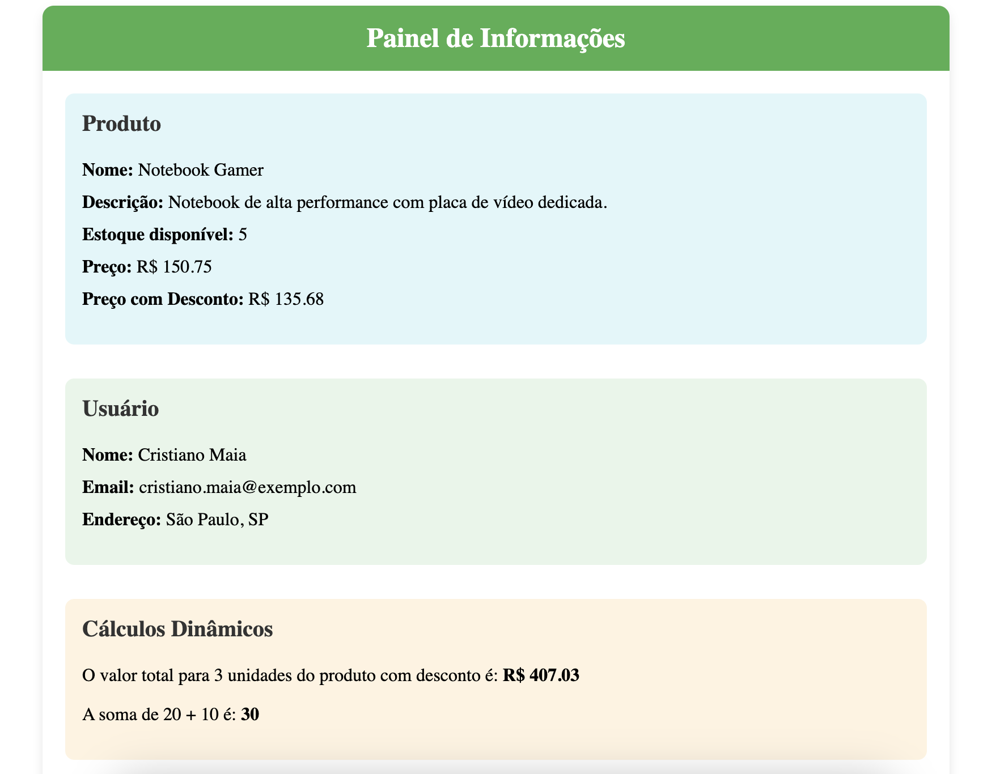

### Interpolação de texto

É um forma simples e eficiente de exibir valores dinâmicos no template HTML de um componente. Utilizando a sintaxe de chaves duplas ``{{ }}``, podemos vincular variaveis ou expressões do TypeScrip à interface de usuário.

#### Funcionamento:
- Sintaxe: ``{{ expressão }}``, onde pode ser o nome de uma variavel, uma propriedade do componente ou até mesmo uma expressão JavaScript válida.
- Exemplo básico:

**html**
```

<h1>Bem-vindo, {{ nomeUsuario }}!</h1>
```

No TypeScript, teriamos uma propriedade como:
**typescript**
```
nomeUsuario: string = 'Cristiano';
```

Seria exibido no navegador:
**Bem-vindo, Cristiano!**

#### Principais pontos:
1. Atualização automática: sempre qie o valor da variavel no componente é alterado, a exibição no template também é atualizada.
2. Expressões simples: Podemos usar expressões simples dentro das chaves, como operações matemáticas.

**html**
```
<p>A soma de 2 + 2 é {{ 2+2 }}. </p>
```
3. Acesso a propriedade de objetos:
**html**
```
<p>O e-mail é: {{ usuario.email }} </p>>
```

#### Limitações:
- Apenas expressões simples podem ser usadasm chamadas de métodos simples ou operações matemáticas. Não é recomendável realizar lógica complexa dentro das chaves, para manter o código limpo e mais eficiente.


#### Exemplo Utilizando Interpolação de Texto

